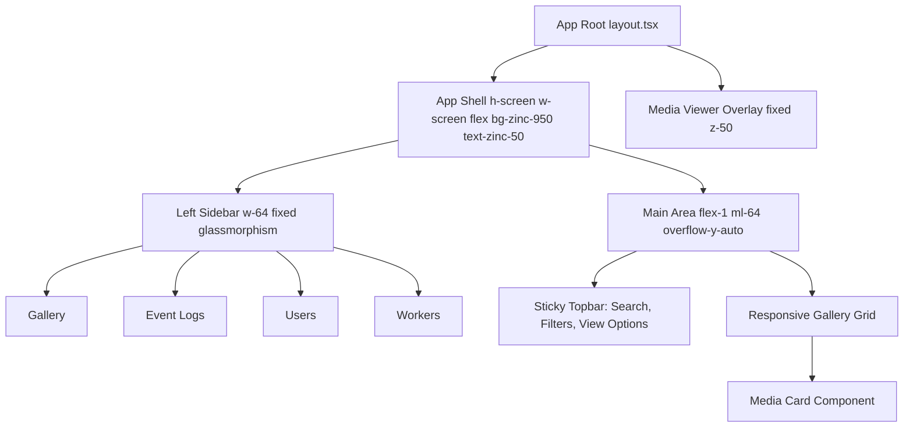

# Blacknails-Media-v3: UI Architecture & Layout Specs

> [!NOTE]
> This document provides the structural blueprint and styling specifications for the Frontend Engineer to implement the minimalist layout. It integrates the mandatory administrative sidebar smoothly without compromising the photo-centric aesthetic of the application.

## 1. Application Structure

The application adopts a classic but ultra-refined shell architecture: a fixed left sidebar and a scrollable main content area.

## 2. Layout Components & Technical Specs

### 2.1. The Application Shell
The container must ensure the sidebar is fixed and the content area scrolls naturally.

**Tailwind CSS 4 Spec:**
- **Wrapper:** `flex h-screen w-screen overflow-hidden bg-white dark:bg-zinc-950 text-zinc-900 dark:text-zinc-50`
- The background color should be a pure solid tone to ensure photos pop without color clashes.

### 2.2. The Minimalist Sidebar
The sidebar contains the main navigation (Gallery, Event Logs, Users, Workers). To maintain the minimalist aesthetic, it should use translucency and monochrome icons, drawing almost no attention until hovered or interacted with.

**Tailwind CSS 4 Spec:**
- **Container:** `fixed left-0 top-0 h-full w-64 flex flex-col border-r border-zinc-200/50 dark:border-zinc-800/50 bg-white/70 dark:bg-zinc-950/70 backdrop-blur-xl z-30 transition-all`
- **Navigation Links:** `flex items-center gap-3 px-4 py-2.5 mx-3 rounded-lg text-sm font-medium text-zinc-600 dark:text-zinc-400 hover:text-zinc-900 dark:hover:text-zinc-100 hover:bg-zinc-100/50 dark:hover:bg-zinc-900/50 transition-colors`
- **Active State:** Ensure the active link uses a distinct but subtle indicator, such as `bg-zinc-100 dark:bg-zinc-800/80 text-zinc-900 dark:text-zinc-50`.

**Framer Motion (Micro-interaction):**
When the user clicks a nav item, use a very subtle scale effect on the icon and perhaps a layout ID highlight for the active background to smoothly transition between tabs.

### 2.3. The Gallery Grid (Main Content)
The main content area must prioritize the media. The UI should fade away.

**Tailwind CSS 4 Spec:**
- **Main Area Container:** `flex-1 ml-64 h-full overflow-y-auto`
- **Grid Layout:** `grid grid-cols-2 md:grid-cols-3 lg:grid-cols-4 xl:grid-cols-5 gap-1 p-6` (Use tiny gaps like `gap-1` or `gap-2` to maximize photo real-estate).
- **Media Card:** `relative aspect-square overflow-hidden group rounded-sm bg-zinc-100 dark:bg-zinc-900`

**Framer Motion & Interaction:**
- The grid items should stagger in on page load: `transition: { staggerChildren: 0.05 }`.
- **Card Hover:** `whileHover={{ scale: 1.02 }}` with a smooth spring transition (`type: "spring", stiffness: 300, damping: 25`).
- **Metadata Overlay:** Only reveal metadata (date, duration, tags) gracefully on hover with a smooth opacity transition. Use a subtle gradient overlay at the bottom: `absolute inset-0 bg-gradient-to-t from-black/60 via-transparent to-transparent opacity-0 group-hover:opacity-100 transition-opacity duration-300`.

### 2.4. Media Viewer Modal (Overlay)
When a user clicks a photo/video, it should expand to fill the screen (excluding or overlaying the sidebar, depending on preference, but usually full-screen is best for media).

**Tailwind CSS 4 Spec:**
- **Backdrop:** `fixed inset-0 z-50 bg-white/95 dark:bg-zinc-950/95 backdrop-blur-2xl flex items-center justify-center`
- **Image/Video Container:** `relative max-w-[95vw] max-h-[95vh] object-contain shadow-2xl`

**Framer Motion:**
- Use `layoutId` on the image wrapper so that clicking the thumbnail seamlessly expands the image into the modal (shared element transition).
- Backdrop fade-in: `initial={{ opacity: 0 }} animate={{ opacity: 1 }} exit={{ opacity: 0 }}`.

## 3. Typography & Colors

| Element | Tailwind 4 Class | Rationale |
| :--- | :--- | :--- |
| **Primary Text** | `text-zinc-900` / `text-zinc-50` | High contrast for main titles and active states. |
| **Secondary Text** | `text-zinc-500` / `text-zinc-400` | Dimmed text for metadata, timestamps, and inactive sidebar links to avoid distracting from photos. |
| **Borders/Dividers** | `border-zinc-200` / `border-zinc-800` | Extremely subtle separators, used with low opacity (e.g. `/50`) to avoid harsh lines. |
| **Font Family** | `font-sans` | Must be configured to Inter, Roboto, or similar modern sans-serif in your CSS theme. |

## 4. Interaction Flow Summary

1. **User enters app:** The Sidebar is permanently visible on the left, rendered cleanly over a glassmorphism pane. The Gallery grid fills the rest of the screen.
2. **Scrolling:** The main area scrolls vertically, leaving the Sidebar fixed.
3. **Hovering a Media Card:** The card slightly scales up (`1.02`), and a subtle gradient reveals metadata (Date, Duration) and action icons.
4. **Clicking Media:** The Framer Motion `layoutId` prop smoothly animates the thumbnail out of the grid and expands it into the center of the screen, while the backdrop fades in, obscuring everything else (including the Sidebar) to focus 100% on the content.
5. **Admin Access:** The user can freely click "Event Logs" or "Workers" in the sidebar, transitioning the main area to functional tables/dashboards without losing the app's clean visual language.
