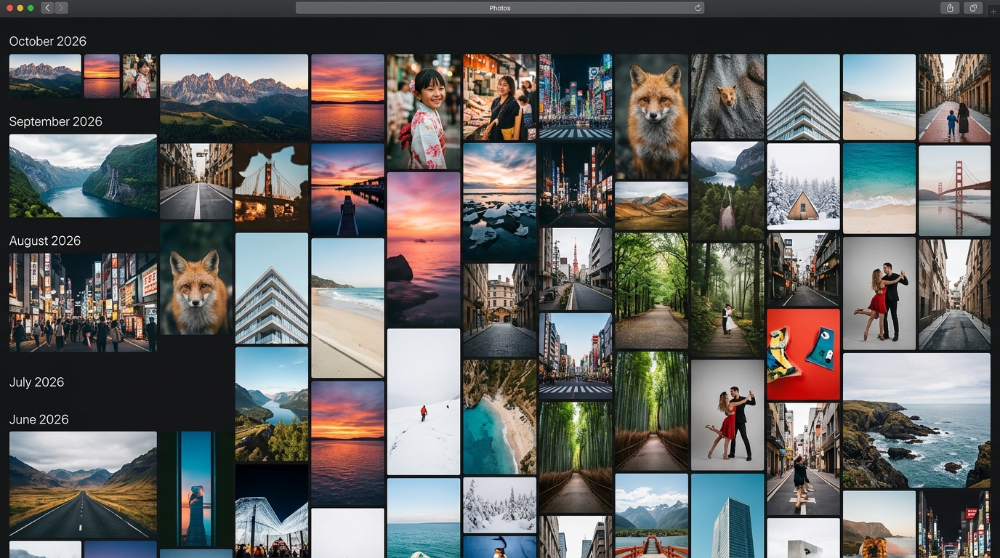
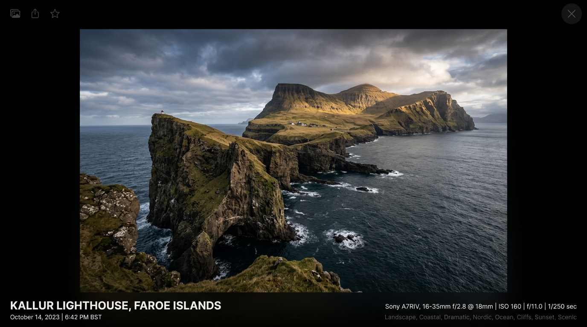

# UX/UI Design Proposal: Blacknails-Media-v3

Based on the newly assimilated `ux-design-philosophy`, here is the revised visual and interaction proposal for the core gallery and media viewing experience. The central tenet of this design is that **the UI must be invisible**, making the media the absolute protagonist.

## 1. Gallery View

The Gallery View is a wall-to-wall experience focused entirely on the content. We have completely eliminated any concept of generic dashboards, "Projects", "Teams", or "Workspaces".

### Interaction Flow
- **Initial Load:** The user lands on the gallery route. Photos load progressively, revealing a masonry or square grid layout.
- **Scrolling:** As the user scrolls, a subtle sticky header appears detailing the timeline (e.g., "October 2026"). The background is a deep slate dark mode to prevent any color tinting.
- **Hover State:** Hovering over a media card triggers a subtle `0.2s` Framer Motion scale-up (`scale: 1.02`), signaling interactivity without intrusive borders or shadows.
- **Click Action:** Clicking a photo expands it into the Image Modal using a fluid Framer Motion `layoutId` animation, giving a physical, seamless transition from the grid to the lightbox.

### Component Rationale
- **No "Upload" Button:** The absence of an upload button reinforces the self-hosted, background-ingestion nature of the app (via the `library/import` folder). The UI is strictly for consumption and organization.
- **No Sidebars or Project Tabs:** To maintain a pure, uncluttered aesthetic akin to Apple Photos, navigation is minimal. The focus remains 100% on the timeline of photos.
- **Sticky Date Headers:** Provides necessary context for navigation while scrolling without taking up permanent screen real estate.

---

## 2. Image Modal (Lightbox)

The Image Modal is the immersive viewing state where the photo takes up the entirety of the screen on a pure black background.

### Interaction Flow
- **Opening:** The photo expands from its grid position. The background fades to a deep pure black (`#000000`).
- **Viewing:** The UI elements (close button, EXIF metadata, AI tags) appear only after a brief delay (`0.3s`) and fade out automatically if the user's cursor is idle, ensuring zero distractions.
- **Closing:** Swiping down, pressing `Esc`, or clicking the subtle close icon scales the image back down into its exact position in the gallery grid.
- **Hovering Metadata:** Moving the cursor over the bottom area smoothly fades in the typography detailing the date, location, camera settings, and AI-generated tags.

### Component Rationale
- **Pure Black Background:** Ensures the colors of the photograph pop and are represented accurately without any UI color interference.
- **Translucent / Fading UI:** Controls and metadata exist but only when actively requested by the user's interaction. This honors the "invisible UI" rule.
- **Typography Hierarchy:** We use a modern, highly legible sans-serif font. The visual weight and opacity (e.g., `text-zinc-400` for camera settings vs. white for the main title) establish hierarchy instead of relying solely on font size, maintaining an ultra-premium feel.

> [!NOTE]
> All animations should feel physical and grounded. Avoid linear easing; rely on spring physics (stiffness/damping) via Framer Motion to match the high-end feel.
